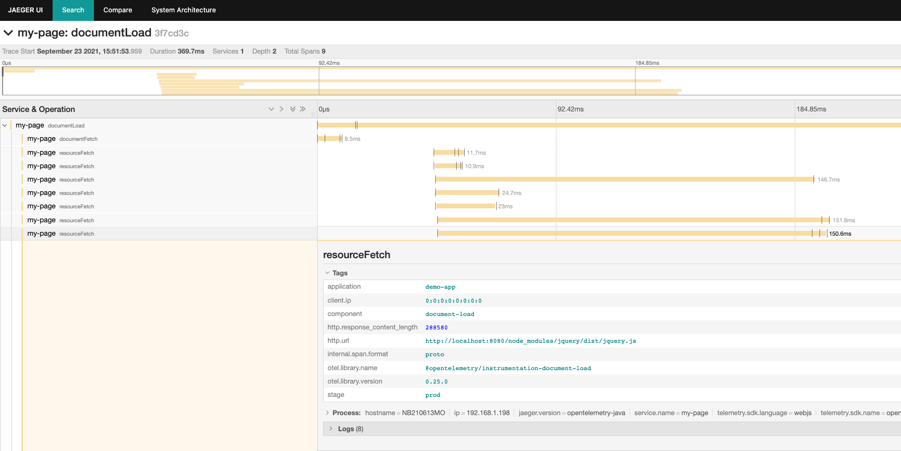

# Boomerang-OpenTelemetry Plugin


This is a [Boomerang plugin](https://github.com/akamai/boomerang) for collecting spans using the [OpenTelemetry](https://opentelemetry.io/) framework and exporting them, e.g., to an OpenTelemetry collector.
The plugin is based on the [opentelemetry-js](https://github.com/open-telemetry/opentelemetry-js) implementation.
The plugin version always corresponds to the opentelemetry-js version that's being used internally.


*Example Screenshot of recorded spans using Jaeger and the Ocelot EUM Server*

## Using with Angular

This module provides Zone Context Manager with a dependency for zone-js for Web applications. If you use Angular you already have the zone-js. In this case, this might case some problems and you should use a custom build of this library where zone-js has been removed.

## Features

Currently implemented features:

* Automatic instrumentation of the asynhrounous XMLHttpRequest API and Fetch API, including B3 header propagation. [More details ↗](https://www.npmjs.com/package/@opentelemetry/instrumentation-xml-http-request)
* Automatic tracing of the initial page load including resource timings.
* Automatic instrumentation of user interactions.
* Automatic local context propagation using _Zone Context Manager_. [More details ↗](https://www.npmjs.com/package/@opentelemetry/context-zone)
* Exporting collected spans to an OpenTelemetry collector.
* Providing access to the OpenTelemtry Tracing-API for manual instrumentation.
* Adding global variables to spans during runtime via _addVarToSpans()_
* Tracing of the whole transaction with the document load span as root span

### OpenTelemetry Plugins

A list of OpenTelemetry instrumentation and non-instrumentation plugins that are currently included in this Boomerang plugin:

* [@opentelemetry/exporter-collector](https://github.com/open-telemetry/opentelemetry-js/tree/main/packages/opentelemetry-exporter-collector)
* [@opentelemetry/instrumentation-xml-http-request](https://github.com/open-telemetry/opentelemetry-js/tree/main/packages/opentelemetry-instrumentation-xml-http-request)
* [@opentelemetry/instrumentation-fetch](https://github.com/open-telemetry/opentelemetry-js/tree/main/packages/opentelemetry-instrumentation-fetch)
* [@opentelemetry/instrumentation-document-load](https://github.com/open-telemetry/opentelemetry-js-contrib/tree/main/plugins/web/opentelemetry-instrumentation-document-load)
* [@opentelemetry/instrumentation-user-interaction](https://github.com/open-telemetry/opentelemetry-js-contrib/tree/main/plugins/web/opentelemetry-instrumentation-user-interaction)

## Setup

The basic setup requires only to include the `boomerang-opentelemetry.js` file to the list of the boomerang plugins to run. This setup works out-of-the-box with the  [inspectit-ocelot EUM server](https://github.com/inspectIT/inspectit-ocelot-eum-server).

By default, collected spans will be sent to an URL relative to the defined `beacon_url` Boomerang property in case your `beacon_url` ends with `/beacon`. In this case, an endpoint for spans is used, where `/beacon` is replaced by `/spans`. However, if you use different URLs, the collector URL must be configured accordingly.

## Configuration

The plugin is configured using the standard [Boomerang configuration](https://developer.akamai.com/tools/boomerang/docs/index.html).
All available configuration options are optional.

```
BOOMR.init({
  beacon_url: 'http://localhost:8080/beacon/',
  
  OpenTelemetry: {
    samplingRate: 1.0, // an optional sampling rate
    corsUrls: ['https://my.backend.com'],
    consoleOnly: false, // an optional flag whether spans should only be printed to the console
    collectorConfiguration: {
      url: 'http://localhost:55681/v1/trace', // an optional url for an OpenTelemetry collector
      headers: {}, // an optional object containing custom headers to be sent with each request
      concurrencyLimit: 10, // an optional limit on pending requests
    },
    plugins_config: {
      instrument_fetch: {
        enabled: false,
        clearTimingResources: false,
        path: "",
        applyCustomAttributesOnSpan: null, //A method with the following structure: (span: Span, request: Request) => { },
        ignoreUrls: [],
        propagateTraceHeaderCorsUrls: []
      },
      instrument_xhr: {
        enabled: false,
        path: "",
        applyCustomAttributesOnSpan: null, //A method with the following structure: (span: Span, xhr: XMLHttpRequest) => { },
        propagateTraceHeaderCorsUrls: [],
        ignoreUrls: [],
        clearTimingResources: false,
      },
      instrument_document_load: {
        enabled: false,
        path: "",
        recordTransaction: false, //If true, the transaction will be traced with the document load span as root span
        exporterDelay: 20 // Delay to allow the exporter to export the transaction span before page unload
      },
      instrument_user_interaction: {
        enabled: false,
        path: "",
      },
    },
    // Use these options only for legacy configuration. Instead using plugins_config is recommended.
    plugins: {
      instrument_fetch: true,
      instrument_xhr: true,
      instrument_document_load: true,
      instrument_user_interaction: true
    },
    // Additional instrumentation config, which will be applied to all plugins
    global_instrumentation_config: {
      // Include request paramater to spans and the corresponding beacons
      requestParameter: {
        enabled: false,
        excludeKeysFromBeacons: [] //Keys, which should not be included in beacons, for instance due to cardinality concerns
      }
    },
    exporter: {
      maxQueueSize: 100,
      maxExportBatchSize: 10,
      scheduledDelayMillis: 500,
      exportTimeoutMillis: 30000,
    },
    commonAttributes: {
        "application": "demo-app",
        "stage": "prod"
    },
    serviceName: () => BOOMR.getVar("page_name") || "unknown_service", // an optional service name for the spans
    prototypeExporterPatch: false // patches the OpenTelemetry collector-span-exporter in case the Prototype framework is used
    propagationHeader: "TRACE_CONTEXT",
  }
});
```
Available options are:

| Option                                    | Description                                                                                                                                                                                                                                                                                                                                                      | Default value |
|-------------------------------------------|------------------------------------------------------------------------------------------------------------------------------------------------------------------------------------------------------------------------------------------------------------------------------------------------------------------------------------------------------------------|---|
| `samplingRate`                            | Sampling rate to use when collecting spans. Value must be between `0` and `1`.                                                                                                                                                                                                                                                                                   | `1` |
| `corsUrls`                                | Array of CORS URLs to take into consideration when propagating trace information. By default, CORS URLs are excluded from the propagation.                                                                                                                                                                                                                       | `[]` |
| `collectorConfiguration`                  | Object that defines the OpenTelemetry collector configuration, like the URL to send spans to. See [CollectorExporterNodeConfigBase](https://www.npmjs.com/package/@opentelemetry/exporter-collector) interface for all options.                                                                                                                                  | `undefined` |
| `consoleOnly`                             | If `true` spans will be logged on the console and not sent to the collector endpoint.                                                                                                                                                                                                                                                                            | `false` |
| `plugins`                                 | Object for enabling and disabling OpenTelemetry plugins.                                                                                                                                                                                                                                                                                                         |  |
| `plugins.instrument_fetch`                | Enabling the [OpenTelemetry plugin](https://github.com/open-telemetry/opentelemetry-js/tree/main/packages/opentelemetry-instrumentation-fetch) for insturmentation of the fetch API. This will only be used in case the `fetch` API exists.                                                                                                                      | `true` |
| `plugins.instrument_xhr`                  | Enabling the [OpenTelemetry plugin](https://github.com/open-telemetry/opentelemetry-js/tree/main/packages/opentelemetry-instrumentation-xml-http-request) for insturmentation of the XMLHttpRequest API.                                                                                                                                                         | `true` |
| `plugins.instrument_document_load`        | Enabling the [OpenTelemetry plugin](https://github.com/open-telemetry/opentelemetry-js-contrib/tree/main/plugins/web/opentelemetry-instrumentation-document-load) for insturmentation of the document load (initial request).                                                                                                                                    | `true` |
| `plugins.instrument_user_interaction`     | Enabling the [OpenTelemetry plugin](https://github.com/open-telemetry/opentelemetry-js-contrib/tree/main/plugins/web/opentelemetry-instrumentation-user-interaction) for insturmentation of user interactions.                                                                                                                                                   | `true` |
| `global_instrumentation`                  | Object for configuring additional instrumentations, which will be applied to every OpenTelemetry plugin.                                                                                                                                                                                                                                                         ||
| `global_instrumentation.requestParameter` | If enabled, existing request parameters will be added as attributes to spans and, if not excluded, will be added to the corresponding beacon as well.                                                                                                                                                                                                            ||
| `exporter`                                | Object for configuring the span exporter. Only used if `consoleOnly` is not enabled.                                                                                                                                                                                                                                                                             ||
| `exporter.maxQueueSize`                   | The maximum queue size. After the size is reached spans are dropped.                                                                                                                                                                                                                                                                                             | `100` |
| `exporter.maxExportBatchSize`             | The maximum batch size of every export. It must be smaller or equal to `maxQueueSize`.                                                                                                                                                                                                                                                                           | `10` |
| `exporter.scheduledDelayMillis`           | The interval between two consecutive exports.                                                                                                                                                                                                                                                                                                                    | `500` |
| `exporter.exportTimeoutMillis`            | How long the export can run before it is cancelled.                                                                                                                                                                                                                                                                                                              | `30000` |
| `commonAttributes`                        | An Object defining common span attributes which will be added to each recorded span.                                                                                                                                                                                                                                                                             | `{}` |
| `serviceName`                             | A `string` or function which can be used to set the spans' service name. A function can be defined for dynamically providing the service name, e.g. based on Boomerang values.                                                                                                                                                                                   | `undefined` |
| `prototypeExporterPatch`                  | Patches the OpenTelemetry collector-span-exporter, so it is compatible with the Prototype framework. This is only necessary and should only be activated, when the Prototype framework is used. [For more information see the linked file](https://github.com/NovatecConsulting/boomerang-opentelemetry-plugin/blob/master/src/impl/patchCollectorPrototype.ts). | `false` |
| `propagationHeader`                       | Defines the format of the context propagation header. Available formats: `TRACE_CONTEXT`, `B3_SINGLE`, `B3_MULTI`                                                                                                                                                                                                                                                | `TRACE_CONTEXT` |

## Manual Instrumentation

The boomerang OpenTelemetry Plugin also exposes a part of the OpenTelemetry tracing API for manual instrumentation:

```
const tracer = window.BOOMR.plugins.OpenTelemetry.getTracer("my-library-name", "v1.0");

const span = tracer.startSpan("doSomething");
// do something
span.end();
```

For execution of functions within a span context, the plugin provides the following convenient function: `withSpan(span, fn)`

```
const OT = window.BOOMR.plugins.OpenTelemetry;
const tracer = OT.getTracer("my-library-name", "v1.0");

const span = tracer.startSpan("doSomething");
OT.withSpan(span, () => {
  // do something
});
span.end();
```

The plugin also provides direct access to the OpenTelemetry API via the following function: `getOpenTelemetryApi()`. This returns the OpenTelemetry API and can be used for more advanced data collection.

## Transaction Recording

If `plugins.instrument_document_load.recordTransaction` is set `true`, the document load span will be kept open during the whole transaction
and will be used as root span. 
This transaction span will stay open until page unload or until the function 
`startNewTransaction(spanName: string)` was called. This function closes the current transaction span and opens a new one with
the provided span name.

Additionally, during the page load the document load span will check the `Server-Timing`-response-header for an existing trace context.
If existing, this trace context will be used to create the document load span.
The trace context should be included in the `Server-Timing`-header like this: 

`traceparent; desc="00-f524a0cf2c5246077dd36b094d8e1132-b5fa4f189acedb66-01"`

## Asynchronous inclusion of Boomerang

Make sure to check that `window.BOOMR.plugins.OpenTelemetry` actually exists prior to using it in your code in case you load boomerang asynchronously.

## Development

During development, the plugin can be compiled and automatically recompiled whenever a file is changed using: `yarn watch`

The plugin can be built using the command: `yarn build`

### Release

To create a release, create a new Tag following the structure `*.*.*`. 
Write a meaningful message for the tag, since that will be the release's text as well.
Then push the tag. 
The GitHub Action "Create new Release" will build the plugin and its software bill of materials, and then create a new release automatically.
